# Maestro



> **One workflow. Your whole team. Every time.**
> _Deterministic workflows for AI coding agents._

Set up your team's flow once and everyone runs it the same way, right inside Claude Code or Cursor — same steps, same gates, same result whether it's a staff engineer or a first-week hire. An engine that follows the plan, not an agent that improvises one.

Maestro is a thin, deterministic layer that turns "vibe-coding with an AI agent" into a **repeatable, reviewed practice your whole team follows**.

The trick: your interactive Claude Code / Cursor session is the *lead agent*, but a small stdlib-Python engine decides every step — the LLM just dispatches each action and never interprets the graph. The flow itself is a plain YAML workflow, drawn in a visual builder and versioned in Git like any other code.

- **No headless runner, no separate API key, no per-seat orchestration bill.** Maestro delegates every model call to your host, so it runs on whatever auth you already have — your existing Claude Code / Cursor subscription, or your own API key if the host is set up with one. Your keys never touch the engine.
- **Proof, not promises.** Every producing step must write a real artifact to disk or the engine refuses to advance.
- **Human gates on every irreversible decision.** Kill your session anytime; the run resumes exactly where it stopped.

## Who it's for

**Leads / platform teams — you author the flow.** Encode your team's SDLC as a workflow: what runs, in what order, where the human gates are, who approves a release. Review it like code, version it, publish it. It becomes the paved road everyone drives.

**Developers — you follow the flow.** Run `/maestro my-feature` in your own editor. The engine walks you through the lead's exact pipeline — spawns each step, asks you at gates, and shows where every artifact landed. You can't silently drift: edit the workflow mid-run and the engine halts on a hash mismatch until you explicitly rebase.

## 30-second quickstart

```bash
# from your git repo root — or, for a multi-repo feature, an umbrella workspace (see below).
# needs python3 ≥ 3.8, stdlib only
curl -fsSL https://raw.githubusercontent.com/KeyValueSoftwareSystems/kv-skills/main/install.sh \
  | bash -s -- claude-code            # or: cursor

# then, inside your IDE:
/maestro-init                         # detect stack, install matching packs, build docs
/maestro my-feature                   # runs the shipped AI-SDLC pipeline
```

Drop your requirement files (PRDs, tickets, notes) into the folder it scaffolds, and it runs: PRD → design → review → implement → QA → release, pausing at each human gate. That's it — no key to provision, nothing to `pip install`.

## Recommended layout: an umbrella workspace

**If your feature spans more than one repo — e.g. a frontend and a backend — do not install Maestro inside one of them.** A design is only as good as what the agent can see: run it from inside a single service repo and it designs blind to the others (choosing an architecture the frontend allows but the backend can't serve, missing a flow that lives across the boundary). The fix is a **parent/umbrella repo** that holds Maestro and the service repos side by side, so the lead agent sees the whole stack at once:

```
my-project/                 ← umbrella repo — git init here; run /maestro from here
├── maestro  .claude/  .maestro/   ← Maestro installs here (engine, workflows, runs/<slug>/…)
├── codebase/               ← the service repos, each cloned here and GITIGNORED
│   ├── frontend/  └─ CLAUDE.md     ← independent repo: own branches, PRs, CI
│   ├── backend/   └─ CLAUDE.md
│   └── payments-service/
├── docs/                   ← centralised cross-repo docs
└── test/                   ← cross-repo integration + UI-automation suites
```

Set it up once per project, then install Maestro into the umbrella root and run every feature from there — artifacts land in `.maestro/runs/<slug>/` while the agent edits the real service repos under `codebase/` in their own worktrees. A single repo still works; the umbrella is what makes multi-repo features design correctly. **Full walkthrough (child-repo `CLAUDE.md` files, `/build-knowledge`, one-command local stack): [docs/umbrella-workspace.md](docs/umbrella-workspace.md).**

## Why Maestro instead of…

| Tool | What it is | Why Maestro instead |
|------|-----------|---------------------|
| **Claude Code Dynamic Workflows** | The model *generates* the orchestration on the fly — different every run | Maestro's flow is human-authored and identical every run: reviewable, diffable, ownable by a lead |
| **Conductor / Temporal** | Server-side durable orchestration engines | Maestro runs locally in your editor — no runtime, no infra, no ops |
| **CrewAI / AutoGen / Swarm** | Agent frameworks that need their own model credentials | Maestro uses your existing host + subscription; it holds no keys and calls no APIs itself |

Maestro isn't trying to replace a durable production orchestrator or an autonomous agent. It owns the desk-side layer: the reviewed, repeatable flow a developer runs while building.

## The example pipeline

Shipped as a worked example (`.maestro/workflows/sdlc-main.yaml` + the `.claude/skills/` pack) — a full AI-SDLC pipeline you can run today and fork into your own:

```
requirement → PRD (consolidate what you gave, or brainstorm one via gated Q&A)
   → HLD → [open-questions loop → approve] → parallel LLDs → API contract
   → functional test cases → architecture review → [approve]
   → implement per stack (parallel, sliced, reviewed, bounded fix loop)
   → QA → review pack → [approve → release → archive: harvest lessons + publish docs]
```

**You define the workflow; you bring the skills.** The engine is the product. A workflow is a YAML file describing what runs in what order; each agent step names a *skill* (a reusable prompt) — yours, ours, or a third party's (Obra, Superpowers, …). The workflow owns *where* artifacts land and *when* each step runs; the skill owns only *how* to do its one job, so any skill can be swapped without touching the graph.

## How it works

```
            you: /maestro my-feature
                     │
       ┌─────────────▼──────────────┐    .maestro/engine/maestroctl.py (stdlib python3)
       │  LEAD AGENT (your session) │───► next → ONE action as JSON
       │  dispatches, never decides │◄─── complete / gate-record / fail
       └──┬─────────┬──────────┬────┘
          ▼         ▼          ▼
      subagents   scripts    you (gates)
      (skill +    (validators,
       model per   stubs)
       step)
```

- **`workflow.yaml`** — the graph: 5 node types (`agent`, `gate`, `script`, `parallel`, `subworkflow`), per-node routes with tiny conditions, and **back-edges for loops** (an arrow to any earlier step; the engine cascade-resets downstream work and enforces a per-node visit cap so loops can't run away). Spec: [docs/workflow-spec.md](docs/workflow-spec.md).
- **`.maestro/runs/<slug>/state.yaml`** — the run ledger. Only the engine writes it. Resume, revise-cascades, gate history, parallel-join bookkeeping all live here.
- **The lead agent never interprets the graph.** The deterministic resolver serves one fully-rendered action at a time; the LLM just dispatches it. That's what makes an LLM-driven orchestrator reliable — and it's all plain, tested Python (see [Checks](#checks); no LLM in the loop).
- **Agent steps are instruction-first**: write what the step should do; optionally pin a skill (the shipped workflows pin everything for reproducibility) and a model. Subagents run in parallel where the harness supports it (Claude Code); elsewhere the same workflow runs inline and sequential — same engine, same state.

Workflows are deliberately minimal to write by hand too — this is a complete one:

```yaml
nodes:
  - id: implement
    instruction: Implement the fix described in the requirement, with tests.
    next: review
  - id: review
    instruction: Review the changes; set blocking=true for must-fix issues.
    outputs: [blocking]
    max_visits: 3
    routes:
      - {when: "${steps.review.outputs.blocking} == true", to: implement}
      - {to: end}
```

(`type:` defaults to agent, `start:` to the first node, omitted routing to `end`.)

## The visual builder

**`./maestro ui`** serves the builder on a local port (default `8422`, `--port` to change). Because it knows your repo, the **Runs** view and **Open**/**Save** work over HTTP in any browser — or open `.maestro/ui/builder.html` directly and it runs fully offline from `file://` (the folder view needs Chrome/Edge).

- **Author visually** — **New** blank canvas, **Open** any workflow in the repo, or **Paste** YAML. Drag nodes and arrows; an arrow pointing back is a loop (dashed, with its repeat-limit badge). Nodes are instruction-first (skill defaults to *Auto*), gates' options *are* their edges, and parallel branches drill in. Live validation, and **Save** (`⌘S`) exports YAML the engine accepts.
- **Runs** (top-right) — a read-only live status board: pick a slug and the graph colours in as it progresses (**green** done, **orange** running, **red** failed, grey pending).

`./maestro ui` and `./maestro install` are dev tooling only — the wrapper never drives a run or writes `.maestro/**/state.yaml` (that stays the `/maestro` skill + engine's job).

## Prerequisites

- **Recommended: an umbrella workspace.** For the best SDLC output, don't run Maestro inside one isolated service repo — stand up a **parent/umbrella repo** per project, clone the service repos you're changing (gitignored) underneath it, and install Maestro into that parent. The lead agent then sees the whole stack at once. Full setup: [docs/umbrella-workspace.md](docs/umbrella-workspace.md). A single repo works too; the umbrella just gives better cross-repo results.
- **python3 ≥ 3.8** (stdlib only — nothing to `pip install`). Check: `python3 --version`.
- **git** and, to install, **bash** + **curl**. Your project must be an initialized git repository with at least one commit before the implementation phase — the per-stack implement steps run in isolated `git worktree`s, which a non-repo can't provide (`git init && git add -A && git commit` once if it isn't one yet).
- An AI coding harness that supports skills — **Claude Code** (full: parallel subagents, per-step models) or **Cursor** (inline sequential fallback).
- Optional: **node/npx**, only for auto-installing the six external Superpowers helper skills. Without it the flow still runs (skills fall back to inline behavior).
- **OS:** macOS and Linux are first-class. On **Windows use WSL** — the installer is bash and the engine's file lock uses `fcntl` (a `msvcrt` fallback exists, but WSL is the tested path).

## Install

From the root of your project repo:

```bash
curl -fsSL https://raw.githubusercontent.com/KeyValueSoftwareSystems/kv-skills/main/install.sh \
  | bash -s -- claude-code cursor        # pick your IDE(s)
```

Installs: our skills/commands/agents into `.claude/` / `.cursor/`, and the engine + `workflows/` + `ui/` + `docs/` all under a single **`.maestro/`** parent in your repo (so your repo root stays clean and nothing collides with your own `engine/`/`docs/`/`ui/` dirs). The engine is stdlib-only python3 — no CLI, no config file, nothing else to install. When it finishes it prints a short next-steps notice pointing at `/maestro-init` and **`./maestro help`** — the full guide (getting started, the recommended `.gitignore` + what to commit, upgrade/uninstall). **Upgrade** by re-running the same command (it re-fetches and overwrites `.maestro/engine/`/`.maestro/ui/`). *(Private-repo fork? The piped `curl` can't authenticate — clone it and run `./install.sh` from the checkout.)*

### Finish setup: `/maestro-init` (recommended)

The one-liner above installs the core pack. To finish setting the repo up, open your IDE and run **`/maestro-init`** once — the easy button that onboards a repo in one shot. It:

1. **detects your stack** (`detect-stack`) and re-runs the installer with the matching `--stack …`, so only the core pack + the per-stack skills/agents your code actually uses get installed;
2. **builds the living-docs knowledge base** (`build-knowledge`) — per-domain technical + functional docs and an architecture diagram under `docs/`, plus a per-repo **`docs/codebase-map.md`** (the standing grounding each HLD reads before choosing an architecture), which the design and review steps read as context.

The codebase map is **commit-tracked and incremental**: the engine (`codebase_scan.py`) records the git commit each `docs/codebase-map.md` reflects, so re-running (and the post-feature refresh in the archive phase) only re-examines the diff since that commit — not the whole repo. In an umbrella workspace each repo keeps its own map, committed and pushed in that repo.

```bash
/maestro-init                 # detect stack → install matching packs → build docs
```

It's idempotent — safe to re-run after a stack change (it refreshes, never duplicates). Newly installed skills/agents become active once your IDE reloads its config; then start a feature with `/maestro <slug>`.

**Prefer to pick stacks by hand?** The pack ships per-stack reference skills + reviewers (Go, Java/Spring, Kotlin, Python/Django, React, Vue, Angular, Node, Rust, Flutter, Android, DB…); install only what your repo uses instead of running `/maestro-init`:

```bash
./maestro install claude-code --stack go,react,db   # core + those stacks only
```

Anything without a `stack:` tag is core and always installs; `--stack all` (or no flag) installs every stack.

## Run

Everything happens inside your IDE — no CLI:

```
/maestro my-feature                                  # full pipeline (.maestro/workflows/sdlc-main.yaml)
/maestro my-feature .maestro/workflows/design.yaml   # just one phase
/maestro                                             # no slug → lists existing runs to resume, or start new
```

Called with no slug, the lead agent asks the engine which runs exist and lets you **pick one to resume or start a new feature** (it never invents a slug).

On first run the lead agent scaffolds `.maestro/runs/my-feature/requirement/`. Drop any requirement files in there (PRDs, tickets, notes — every file is read); the shipped pipeline then **builds a PRD** (`requirement/prd.md`) before the HLD:

- **you gave it a complete requirement** → it consolidates that into the PRD as-is, no questions;
- **partial or nothing** → a gate offers *add files & re-check* / *brainstorm it with me* / *abort*, then asks for optional **references** (Figma links, doc/file paths, tickets), and a gated Q&A loop fills the high-level product gaps.

From there it validates, starts or resumes the run, spawns a subagent per step, asks you at gates, and reports where every artifact landed.

**You almost never call the engine yourself.** The lead agent issues its verbs — `init`, `next`, `complete`, `gate-record`, `fail`, `runs`, … — for you as it drives the graph. Only two are worth running by hand, for inspection:

```bash
python3 .maestro/engine/maestroctl.py status --slug my-feature              # step table, gates, active steps
python3 .maestro/engine/maestroctl.py validate .maestro/workflows/my.yaml   # lint a workflow before running it
```

If a run gets stuck, `reset --slug <slug> --step <id> --cascade` and `rebase --slug <slug>` are your recovery levers — see [Working as a team](#working-as-a-team).

Prefer manual control? Every step is also a skill you can invoke on its own — the slash command is the skill's own name: `/brainstorm` (author a PRD), `/plan`, `/backend-design`, `/backend-implement`, `/qa-automation`, … — same skills, no orchestration.

### Pausing & resuming a run

A run is durable and does **not** have to finish in one turn. All progress lives in the engine ledger (`.maestro/runs/<slug>/state.yaml`), so you can close the session anytime and pick up later — resume with `/maestro <slug>` (or `/maestro` to choose from the list) and it continues from the exact step, re-running nothing.

Sometimes the lead agent ends its turn *mid-run* — after a long step, or because the harness ended the turn. That's normal and loses nothing; just resume. Whether the loop **auto-continues** past such a pause depends on your harness:

- **Claude Code — auto-continue with an opt-in Stop hook.** Maestro ships `.maestro/engine/stop_hook.py`: while a run still has autonomous work pending it keeps the loop going, and it steps aside (lets the turn end) at every human gate and when the run finishes — the human stays in charge at gates. It's read-only and **off by default**. Enable it by adding to `.claude/settings.json`:

  ```json
  {
    "hooks": {
      "Stop": [
        { "hooks": [ { "type": "command", "command": "python3 .maestro/engine/stop_hook.py" } ] }
      ]
    }
  }
  ```

- **Cursor — resume manually.** Cursor has no hook system, so the loop can't auto-continue; when it pauses, just re-run the `/maestro <slug>` command. Tip: run **phase-by-phase** (`/maestro <slug> .maestro/workflows/design.yaml`, then implementation) to keep each session short — a long single-session run is the most common cause of a mid-run stop.

## Working as a team

Maestro is a shared, paved road, not a per-developer toy: keep the flows in a central, PR-reviewed repo owned by your leads/platform team (changes go through review, same as code), and governance falls out of the graph — route the "approve for release" gate to a lead while anyone runs the steps up to it, no extra RBAC layer needed.

The run ledger `.maestro/runs/<slug>/state.yaml` is written **only by the engine** and is git-tracked on purpose (so a run resumes on any machine). Two consequences for a team:

- **One owner per slug at a time.** Two people driving the same `<slug>` in parallel will produce conflicting edits to an engine-owned file. Pick distinct slugs, or hand a run off by committing/pushing `.maestro/runs/<slug>/` and letting the next person resume it.
- **Resolving a state conflict:** never hand-merge `state.yaml`. Take one side, then run `python3 .maestro/engine/maestroctl.py status --slug <slug>` to see where it stands and continue, or `reset --slug <slug> --step <id> --cascade` to redo from a known-good step.
- If you edit a **workflow file** mid-run, the engine halts on the next command with a hash mismatch — nobody silently diverges from the lead's flow. Accept the edit with `maestroctl rebase --slug <slug>` (it re-validates first) or start over with `reset --slug <slug> --all`.

## Upgrade / uninstall / troubleshooting

- **Upgrade:** re-run the install one-liner. It overwrites `.maestro/engine/` and `.maestro/ui/`; your `.maestro/workflows/` and `.maestro/runs/` are left alone.
- **Uninstall:** delete the installed dirs (`.claude/skills|commands|agents`, `.cursor/…`, `.maestro/engine/`, `.maestro/ui/`). Keep `.maestro/runs/<slug>/` — that's your work.
- **"workflow changed" halt:** see *Working as a team* above (`rebase` or `reset`).
- **A step won't complete (exit 4):** the engine refuses to advance without the declared artifact (non-empty) and output fields — re-run the step or `maestroctl fail` it.
- **`status` any time:** `python3 .maestro/engine/maestroctl.py status --slug <slug>` prints the step table, visit counts, and gate history.

## Layout

After install, in your project repo:

```
.claude/  (or .cursor/ — set by the installer)
  skills/     one SKILL.md per SDLC step + maestro (the lead agent) + bootstrap
              (detect-stack, maestro-init, build-knowledge, retrospect)
              + per-stack reference packs tagged stack:<x>
  agents/     core subagents (planner, implementer, reviewer, qa, analyst, general)
              + per-stack reviewers tagged stack:<x>
  commands/   /maestro and /maestro-init slash-command shims (steps are invoked as skills)
.maestro/
  engine/     the deterministic engine (validate · init · next · complete · gate-record
              · fail · reset · rebase · status · graph · note · runs) + ui_server.py + schemas
              + stop_hook.py (opt-in Claude Code auto-continue hook — see "Pausing & resuming")
              + codebase_scan.py (per-repo codebase-map commit tracking for incremental refresh)
  workflows/  the example pack: sdlc-main / design / impl / qa, plus archive /
              build-knowledge / retrospect — customize or replace
  ui/         builder.html (single-file visual editor)
  docs/       workflow-spec.md (the workflow spec)
  memory/     knowledge/ (seeded by /build-knowledge)
  runs/<slug>/  everything for one feature: requirement/ + all artifacts + state.yaml
maestro       repo-local dev wrapper: `maestro ui` (serve the builder) + `maestro install` + `maestro help`
```

## Customizing / bring your own

The engine is generic; the SDLC pack is just one workflow. To make it yours:

- **Write your own workflow** — a YAML file with `nodes:` (agent / gate / script / parallel / subworkflow), routes, and back-edges for loops. The builder writes it for you. Spec: [docs/workflow-spec.md](docs/workflow-spec.md). Run it with `/maestro <slug> path/to/your.yaml`.
- **Bring your own skills** — an agent node names a skill; that can be one of ours, one you author (`.claude/skills/<name>/SKILL.md`), or a third-party pack (Obra, Superpowers, …). Because the *workflow node* supplies the instruction, inputs, artifact path and output fields at runtime, a skill only has to describe *how* to do its job — so swapping one for another is a one-line `skill:` change, or omit `skill:` entirely and let the harness auto-pick from installed skills by description.
- **Change a shipped step's behaviour** — edit its skill (`.claude/skills/*/SKILL.md`); the flow is untouched.
- **Models** — per node (`model: sonnet`) or per workflow (`defaults.model`); values are passed to the harness as-is (`haiku` / `sonnet` / `opus` work in Claude Code).
- **Loop bounds** — per node `max_visits` (+ `on_exhausted`), backstopped by `defaults.max_visits` (default 10).
- The merge/contract-check/publish scripts in the example pack are **POC stubs** — wire them to your real runners.
- **Memory (improves over time).** Run `/build-knowledge` once per workspace to seed `.maestro/memory/knowledge/` from your codebase; the design and review steps read it, frozen at init. After a feature, the pre-merge archival phase distills lessons and consolidates them — a lesson becomes trusted (and injected into future runs) only once ≥3 runs corroborate it. See [docs/memory.md](docs/memory.md).

## Checks

These run in the **source/pack repo** (the installer strips `engine/tests` from consumer repos):

```bash
python3 engine/tests/run_all.py                    # engine: parser, validator, ledger,
                                                   # resolver sims, full-SDLC e2e (no LLM)
python3 testdata/test_ui_schema_sync.py            # UI ↔ engine anti-drift (+ cross-parser)
python3 testdata/test_workflow_skill_contracts.py  # every node output ↔ its skill contract
open ui/builder.html#selftest                      # in-browser round-trip suite
```

## License

MIT © 2026 KeyValue Software Systems.
